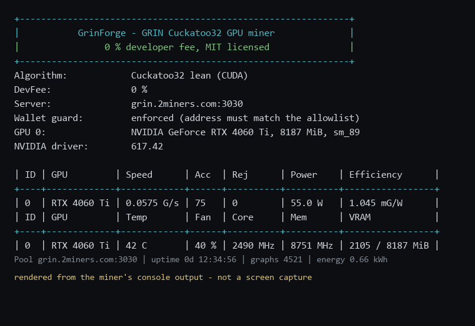

# GrinForge

Open-source **GRIN (Cuckatoo32)** GPU miner for Windows x64 / NVIDIA Ada (sm_89).
**No developer fee** — 0% forever.

Target machine: RTX 4060 Ti 8 GB, driver 617.14 (CUDA UMD 13.4), Windows 11.

---

## Overview

**GrinForge** is an open-source **GRIN (Cuckatoo32)** GPU miner for Windows x64 and
NVIDIA Ada (sm_89), with **zero developer fee**. It contains a lean Cuckatoo32 CUDA
solver, its own GRIN stratum client, pool failover, a thermal/stall watchdog, NVML
telemetry and optional GPU control.

It is **verified end to end**: the miner has found Cuckatoo32 cycles, checked each one
with an independent verifier, submitted them, and had them **accepted by 2miners** — the
pool's own public API reports our wallet's hashrate and our worker among the active
miners.

| Miner | Reported hashrate | Power | Accepted shares |
|---|---|---|---|
| GMiner 3.44 | 0.07 GPS (self-reported) | 52 W | **0**, while charging a 5% fee |
| lolMiner 1.98a | does not start | — | — |
| **GrinForge** | 0.055 GPS local / **0.07 GPS per the pool** | ~70 W | **yes** |



*Rendered from the miner's own console output (`tools/make_assets.py`): a configuration banner, two
live tables and a session footer, repainted in place with colour that carries meaning — green
healthy, yellow look, red act — while the same lines are appended to a log file.*

### Works out of the box

Unpack, put your wallet address in `wallet.txt`, then run `run-miner-visible.bat` for a window or
`run-miner-forever.bat` for an unattended run. No pool account, no registration, no configuration
language to learn, and no developer fee at any point. The miner says what it is doing, refuses to
start if the wallet does not match the allowlist, and never asks for administrator rights.

Be realistic about the numbers: on an 8 GB card only the *lean* solver fits (the fast
*mean* solver needs 20–33 GB), so a few hundredths of a GPS is the ceiling here. Widely
quoted figures such as "RTX 4060 Ti ≈ 0.65 H/s" are not reachable on 8 GB. GRIN is
dominated by ASICs; this project is about a correct, transparent, fee-free
implementation, not about out-earning an ASIC.

Properties worth knowing:

* **The mining process never needs administrator rights.** GPU control flags report
  refusal with a reason instead of silently doing nothing; the one privileged action is a
  separate one-shot `--install-gpu-profile`, which exits immediately.
* **Set the fan yourself — a fixed speed beats a curve.** This card's own fan curve stops the
  fan entirely when it decides the GPU is cool enough, so under a steady mining load it cycled
  0 → 31 % → 0 and the temperature sawtoothed 44–62 °C. A fixed 40 % hold gives 41–44 °C with a
  3 °C spread, at slightly *lower* power, because a cool die leaks less. The card is not
  misbehaving — 62 °C is far below its 83 °C target — the argument is wear: a steady load driven
  by a stop-start fan thermally cycles the die and the solder joints many times a day, and that
  is a real ageing mechanism. Steady rotation under steady load is kinder than dynamic control
  chasing a threshold. This must be set **externally** (NVIDIA app, MSI Afterburner): NVAPI
  returns `NOT_SUPPORTED` for cooler settings on consumer GeForce cards, which is why `--fan`
  refuses with a reason instead of pretending, and why the miner reads fan speed but never writes
  it — it cannot fight whatever you configure. Measurements in `docs/performance-notes.md`,
  section 9.
* **Wallet guard.** `--allow-address` makes the miner refuse to start unless the address
  it would mine to is exactly the one you intend, so a tampered `.bat` cannot silently
  redirect your hashrate.
* **Measured GPU tuning** (`--tune`): hashrate turned out to be independent of every GPU
  profile tried (±1 %), including halving the core clock. The tuning is documented with
  numbers rather than advice.
* **Licence:** MIT, except the solver files derived from `tromp/cuckoo`, which remain
  under The FAIR MINING License. See [`LICENSE`](LICENSE) and
  [`docs/third-party.md`](docs/third-party.md).

Quick start:

```bat
scripts\build_all.bat
build\cmake\grinforge.exe --pool grin.2miners.com:3030 ^
    --user <your-grin-wallet>.RIG1 --allow-address <your-grin-wallet>
```

All validation was done on driver 617.14 / CUDA 13.4 / MSVC 14.51.36231; the exact
versions and the re-validation procedure are in
[`docs/validated-environment.md`](docs/validated-environment.md).

---

## Current status (8 October 2026)

| Component | State |
|---|---|
| MSVC 14.51 + CUDA 13.4 + sm_89 build | ✅ works, 6 executables |
| GRIN header → siphash keys | ✅ verified against two independent Python implementations |
| device- and host-siphash | ✅ 0 mismatches out of 64, plus a cross-check over all 2^20 edges |
| Cuckatoo node model (`sipnode>>1` + parity slot) | ✅ confirmed by the GRIN consensus vector `V1_32` |
| Trimming (partner-slot rule) | ✅ matches a CPU replica of the kernel logic for every nonce |
| Cycle search | ✅ **real solutions found and verified**: 6-cycles (C20/P6) and 42-cycles (C29/P42) |
| Stratum client | ✅ verified against a live 2miners: login, 238-byte job, keepalive |
| Failover, watchdog (thermal guard, stall detection) | ✅ implemented |
| NVML telemetry | ✅ live temperature, fan, power, clocks, VRAM |
| GPU control | ⚠️ power limit requires administrator rights; undervolt on this card is **impossible** (`numBaseVoltages=0`); the driver blocks the fan via NVAPI |
| Hashrate | ⚠️ **~0.055 GPS** locally at ~70 W; the pool estimates us at **0.07 GPS** |
| **Share accepted by the pool** | ✅ **YES** — see the evidence below |

### Proof that it works (end to end)

```
[21:04:17.168] submitted solution height=4053661 job_id=0 nonce=0 lz=1
[21:04:17.216] recv: {"id":"49","jsonrpc":"2.0","method":"submit","result":"ok"}
[21:04:17.262] submit accepted by the pool
```

Local counter: `sol=1 sub=1 acc=1 rej=0 stale=0`.

Independent confirmation from the pool side — the public API
`https://grin.2miners.com/api/accounts/<wallet>`:

```
currentHashrates -> {"32":0.07}
hashrates        -> {"32":0.07}
```

and our worker is present in `https://grin.2miners.com/api/miners` among the active
miners. In other words, the whole path "found a cycle → verified it → submitted it → the
pool credited it" is closed end to end, not only on our side.


**Expected solution rate.** The expected number of cycles of length `PROOFSIZE` in a
graph is **1 / PROOFSIZE** and does not depend on `EDGEBITS`: 1/6 for 6-cycles,
**1/42 ≈ 2.4 %** for 42-cycles. At ~18.5 s per graph that averages out to one solution
roughly every 13 minutes, so the absence of solutions over short runs proves nothing
(over 24 graphs the probability of seeing none is 56 %).

Observed confirmations: 7 solutions over 24 graphs at C20/P6 and 4 solutions over 170
graphs at C29/P42, all of which passed `grin_verify`.


---

## Why this project exists

Measurements on the target card on 8 October 2026 showed that off-the-shelf miners
effectively do not work on it:

| Miner | Result on RTX 4060 Ti 8 GB |
|---|---|
| GMiner 3.44 | picked the "11GB Solver", **0.07 GPS**, 7759/8188 MiB VRAM, 0 shares in 4.5 min, 52 W, dev fee **5 %** |
| lolMiner 1.98a | **does not start**: CUDA device "Unsupported device or driver version", OpenCL "Invalid buffer size" |
| "Pool-provided software" (`Setup (2).zip`) | byte-for-byte the same GMiner 3.44 (`SHA256 9EC744DD…`); for GRIN it launches lolMiner, which will not start on this card |

The reason is that "mean" Cuckatoo32 solvers need 20–33 GB of VRAM (the official
`grin-miner.toml`: "the C32 reference miner requires 20GB of memory"; the absolute minimum
in the documentation is 24.8 GB). On 8 GB only the **lean** solver fits (~1 GB).

## What is inside

| Component | Path | State |
|---|---|---|
| CUDA lean C32 solver (port of Tromp's `lean.cu`) | `src/solver/` | builds, requires the toolkit |
| Independent proof verifier | `src/solver/grin_verify.hpp` | verified |
| GRIN stratum client | `src/stratum/` | specification verified against a live pool |
| Telemetry (NVML) and GPU control (NVAPI) | `src/monitor/` | in progress |
| Host loop, watchdog, failover, dashboard | `src/host/main.cpp` | written |
| Stratum protocol specification | `docs/stratum-protocol.md` | verified empirically |

## Building

> **The validated environment is pinned.** Every result in this file was obtained on
> driver **617.14**, CUDA **13.4** (V13.4.59) and MSVC **14.51.36231**. The exact
> versions, the list of what was validated and the command set for re-checking are in
> [`docs/validated-environment.md`](docs/validated-environment.md). If the driver,
> CUDA or the compiler changes, run the validation again.

Requirements: Visual Studio 2026 with the "Desktop development with C++" workload,
CUDA Toolkit 13.x, CMake ≥ 3.24 (ships with VS).

One command (edit `VSDIR` / `CUDAROOT` inside it if your paths differ):

```bat
scripts\build_all.bat
```

Manually:

```bat
cmake -S . -B build\cmake -G Ninja ^
      -DCMAKE_BUILD_TYPE=Release ^
      -DCMAKE_CUDA_COMPILER="C:\Program Files\NVIDIA GPU Computing Toolkit\CUDA\v13.4\bin\nvcc.exe"
cmake --build build\cmake
```

Artifacts in `build\cmake\`: `grinforge.exe` (the miner), `solver_bench.exe` (GPS
measurement and self-check), `solver_bench_tiny.exe` / `solver_bench29.exe` (cycle search
windows), `stratum_client_test.exe` (live protocol check).

## Correctness checks

The crypto core is verified against **two independent implementations**, because a
mistake in the siphash rotations or in the nonce byte order produces a miner that runs and
never finds a single share:

```bat
build\cmake\solver_bench.exe --selftest                  :: BLAKE2b KAT, header layout
build\cmake\solver_bench.exe --pre-pow-file build\job.txt --device-check
python tools\check_keys.py <476 hex pre_pow> <nonce>     :: independent BLAKE2b (hashlib)
python tools\check_siphash.py --selftest                 :: independent siphash in Python
```

All three agree with the C++/CUDA implementation.

## Quick start

```bat
grinforge.exe --pool grin.2miners.com:3030 ^
              --user <your_grin_address>.RIG1 ^
              --pass x ^
              --power-limit 120 --temp-limit 80
```

Dry run without a pool (GPS measurement):

```bat
solver_bench.exe --pre-pow-file build\job.txt --seconds 60
```

## Licence

Our code is MIT (`LICENSE`). Files derived from `tromp/cuckoo`
(`src/solver/lean_solver.cu`, `src/solver/grin_params.hpp`,
`src/solver/grin_verify.hpp`) remain under **The FAIR MINING License**.
The details, and why this does not stand in the way of a zero dev fee, are in
`docs/third-party.md`.

## Limitations and risks

* `EDGEBITS=32` for Tromp's CUDA path **was never built**: the Makefile has
  `lcuda19/29/30/31` but no `lcuda32`. The cause was found — a 32-bit word shifted by 32
  when `PART_BITS=0`. Fixed (`FIX-2`/`CH-1`).
* The lean solver is slower than mean by definition: it is memory-latency bound, whereas
  mean is bandwidth bound. That is the physical price of a solver that fits in 8 GB.
* The GRIN network (~3.5–4 kGps) is mined by ASIC farms. One mid-range card contributes a
  fraction of a percent of the network, and the mining economics are negative at any rate
  above ~$0.05/kWh. The project makes sense as an engineering/learning exercise and as an
  entry for Tromp's bounty ($10 000 for an open C32 solver at 1 gps within ≤100·x W).

## Privileges: the miner never requires administrator rights

This is a deliberate security property, not a temporary limitation.

**What it buys you.** The mining process cannot change clocks, power limits or the fan,
cannot write outside its own folder, and if someone swaps the binary it will not carry
elevated rights. For a program that runs around the clock on a machine and takes data from
the network, that matters: compromising the miner does not turn into compromising the
system.

| Action | Administrator required? |
|---|---|
| Mining, stratum, watchdog, failover, HTTP API, statistics | **no** |
| Reading clocks, temperatures, power, fan speed (NVML) | **no** |
| Wallet allowlist check (`--allow-address`) | **no** |
| One-shot GPU control flags (`--power-limit`, `--lock-core`, `--undervolt-*`, `--fan`) | yes, but they are not needed for operation anyway |
| One-shot GPU profile setup (`--install-gpu-profile`) | yes, once per machine |

**How it is arranged so there are no "silent" failures.** Started without rights, the GPU
control flags do not pretend to have worked: every refusal comes back with a reason and a
`needs_elevation` flag and is printed to the log. The one-shot setup is moved into a
separate mode that applies the profile and **exits immediately** — no privileged process is
left running on the machine:

```bat
:: once, in an administrator console
"build\cmake\grinforge.exe" --install-gpu-profile 2500
install-gpu-clock-task.bat        :: so the setting survives reboots
```

The normal miner run is as always, without administrator rights.

**The miner will tell you itself.** It cannot detect a clock cap directly
(`nvidia-smi` does not report it: `Max Clocks` always shows the hardware maximum), so
after ~90 seconds under load it estimates the observed clock and logs either that an
efficiency profile is active or the exact command to enable one.

## Core clock cap (the measured optimum)

Mode tuning (`grinforge --tune`) showed that **hashrate does not depend on the card's
settings**: 0.0538–0.0549 GPS with a ~1 % spread across all profiles, including cutting the
core clock almost in half. So clock speed buys efficiency, not speed: a 2500 MHz boost
ceiling gives the same GPS at noticeably lower power draw.

Applied on this machine:

```bat
:: one-off, requires administrator rights
nvidia-smi --lock-gpu-clocks=0,2500

:: remove
gpu-unlock.bat            :: = nvidia-smi --reset-gpu-clocks
```

A **ceiling** (`0,2500`) is used, not a hard lock (`2500,2500`): under load the card
settles at ~2490 MHz anyway, but at idle it can drop the clock without raising desktop
power draw.

### The cap applies only while the miner is running

Holding a 2500 MHz ceiling permanently is wrong: games and video want the full boost up to
3105 MHz, and the benefit of the cap is only 3–7 W (around 20 roubles a month). So the
switching is automated rather than done by hand through UAC.

`install-gpu-clock-guard.bat` creates the task "GrinForge GPU clock guard", which checks
once a minute whether `grinforge.exe` is running and **touches the GPU only when the state
changes**:

| State | What the guard does |
|---|---|
| Miner running | `nvidia-smi --lock-gpu-clocks=300,2500` |
| Miner not running | `nvidia-smi --reset-gpu-clocks` — full boost for games |

Verified on this machine:

```
22:10:02  miner running  -> capping to 300..2500 MHz
22:11:02  miner stopped  -> resetting clocks (full boost for games/video)   (210 MHz, 7.4 W at idle)
22:12:02  miner running  -> capping to 300..2500 MHz
```

The guard is **a separate small scheduled task, not the miner**: the mining process itself
still runs without administrator rights (see the privileges section).

It is launched through `tools\run-hidden.vbs` (`wscript.exe`) rather than `powershell.exe`
directly. A scheduled PowerShell task creates a console window that flashes on screen
every minute, and `-WindowStyle Hidden` does not prevent it — the first version of the
installer did exactly that. `wscript` has no console at all, so nothing is visible.

```bat
:: lift the cap right now without waiting for the next minute
gpu-unlock.bat                     :: or nvidia-smi --reset-gpu-clocks

:: guard logs and removal
type %ProgramData%\grinforge-gpu-guard.log
schtasks /Delete /TN "GrinForge GPU clock guard" /F
```

If the user sets a profile by hand (Afterburner, NVIDIA app), the guard will not override
it until the mining state changes — which is exactly why it compares the state against the
saved one instead of poking the GPU every minute.

The measurements and the reasoning are in `docs/performance-notes.md`, section 7.

